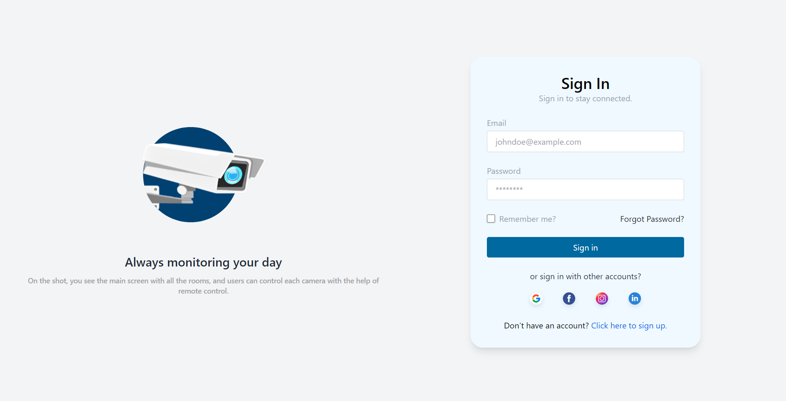
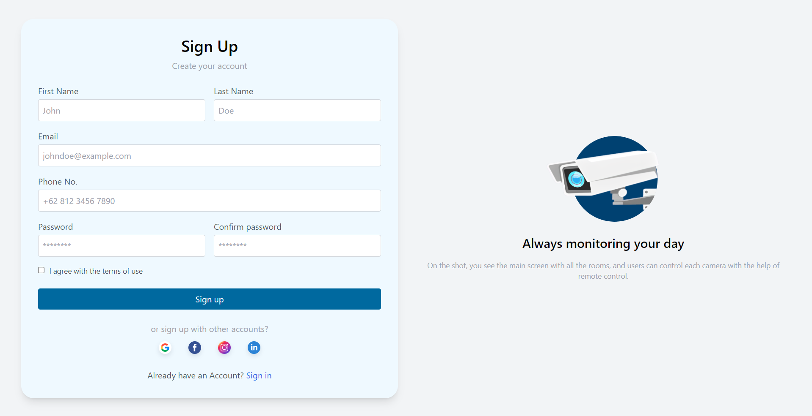
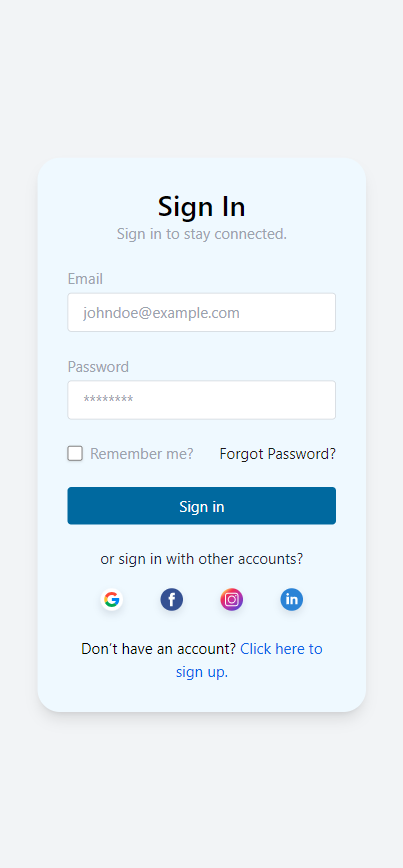
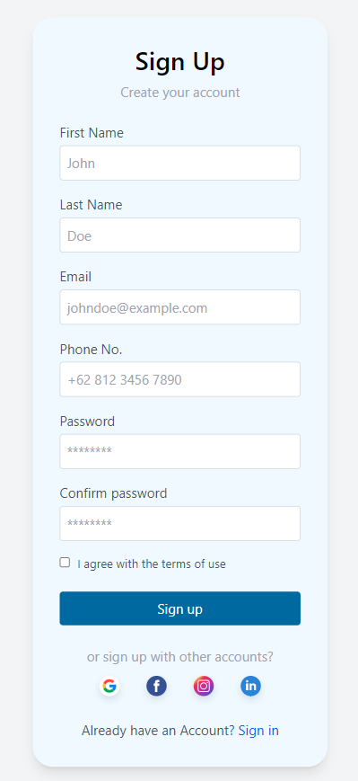

# CCTV-LOGGER

college assignment to build a web cctv logger

- Users can log in using email and password. If they do not have an account, users can register first.
- After logging in, users can upload folders containing images. In addition, users need to enter the start time format: `YYYY-MM-DD HH:MM`, end time, and camera channel (eg: camera 1, camera 2).
- The image data and its information will be saved to the database.
- Users can search for images by selecting a time range (from `YYYY-MM-DD HH:MM` to `YYYY-MM-DD HH:MM`) and selecting the camera channel they want to check.
- After the search results appear, users can view the images one by one with buttons to advance to the next image or back to the previous image.

---

## Page View

> Desktop

- **Sign In Page**
  

- **Sign Up Page**
  

> Mobile
> | **Sign In Page** | **Sign Up Page** |
> | ---------------- | ---------------- |
> |  |  |
